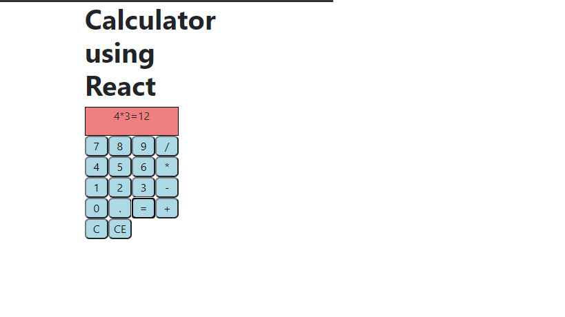

Project Name
Calculator
A Calculator built with React, JavaScript, and CSS.

Project Screenshots:

Installation and Setup Instructions

1)Install node modules

npm install

2)In the project directory, you can run:
npm start

3)Run the app in the development mode.
Open http://localhost:3000 to view it in the browser.

This was a 3 week long project built during my free time at home. I Started learning React JS and started trying out new project for my understanding using visual studio code and tutorial available online.

Technologies:React, JSX, and CSS. 

I chose to use the create-react-app boilerplate
